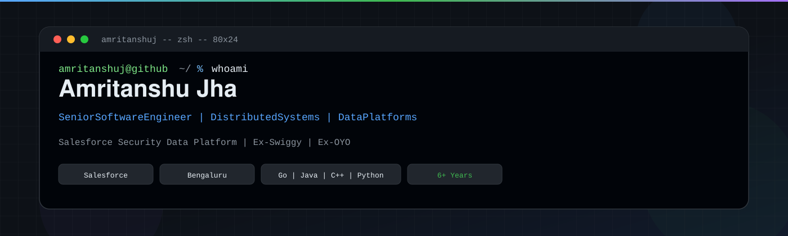
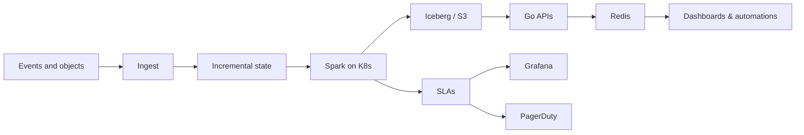

<div align="center">
  
</div>

<br />

<div align="center">
  
</div>

<div align="center">
  <a href="https://github.com/amritanshuj"></a>
  <a href="https://linkedin.com/in/amritanshu-jha"></a>
  <a href="mailto:amritanshu.jha10@gmail.com"></a>
  
</div>

---

I write backends for the moments when traffic spikes, datasets stop fitting in memory, and “it worked in staging” is no longer an argument.

Right now that’s **Salesforce’s Security Data Platform** — Spark on Kubernetes, Iceberg/S3 lakehouses, Go APIs, and the kind of caching, incremental processing, and rollout machinery you only bother building after you’ve been paged for it.

Previously: **Swiggy Delivery Platform** (Java/Go microservices, gRPC, DynamoDB, Kafka) and **OYO Payments**.

```bash
$ cat ~/.gitconfig | grep -A6 '\[user\]'
name  = Amritanshu Jha
role  = Senior Software Engineer
now   = distributed systems, data platforms, reliability
stack = go, java, cpp, python, spark, iceberg, k8s, aws
from  = Salesforce · ex-Swiggy · ex-OYO
```

## now playing

- Leading **Glue → Spark-on-Kubernetes** for multi-TB security ETL: 34 pipelines, 210+ jobs, shared K8s/EC2, no Glue bookmarks to hide behind.
- Rebuilding query paths on **Iceberg + ElastiCache** so security APIs stay in the millisecond club instead of the “please refresh” club.
- Contract-driven **SLA monitoring** (freshness, availability, latency) with Grafana + PagerDuty — because dashboards nobody pages on are just wallpaper.
- Rolling production upgrades (Splunk 8 → 9 on a **252 TB/day** cluster) with the boring kind of success: nobody noticed.

<details>
<summary><strong>a few numbers, if you like receipts</strong></summary>

<br />

| signal | what actually happened |
| --- | --- |
| compute | **73%** lower annual Spark spend (**$1.74M**) after leaving Glue |
| jobs | **42%** faster average runtime on the same security ETL estate |
| APIs | p95 **1.2s → 115ms** on Vulnerability Data API (~**90%**), **77%** cache hit ratio |
| delivery | Swiggy **MVP FY21–22** — New Year peak at **10k+ orders/min** without SLA burn |
| traffic | Delivery path held **300k+ req/min** after monolith → Java/Go + gRPC + DynamoDB |

</details>

## toolbox

<div align="center">
  
</div>

<br />

<div align="center">


</div>

**Languages** — C++, Java (Spring Boot), Go, Python (Flask / FastAPI), SQL  
**Data plane** — Spark, Iceberg, Parquet, Glue, Airflow, DynamoDB, PostgreSQL, Redis / ElastiCache, S3  
**Control plane** — EKS, EC2, Docker, Helm, Argo Rollouts (blue/green), IAM, KMS, Vault, mTLS  
**Messaging** — Kafka, SNS / SQS, EventBridge, gRPC, REST  
**Reliability** — Prometheus, Grafana, Splunk, New Relic, PagerDuty, CI/CD that can actually roll back  
**GenAI, when it earns its keep** — LangChain, RAG, vector stores, Hugging Face, MCP

## how I think about systems



If a pipeline can’t prove freshness, an API can’t survive a stampede, or a deploy can’t roll back in minutes, it isn’t done.

## public repos

Most of the interesting production code lives behind work walls. What’s out here is the public trail — side systems, product experiments, and the stuff I still like opening.

<div align="center">
  <a href="https://github.com/amritanshuj/SmartLink-URL-Shortener">
    
  </a>
  <a href="https://github.com/amritanshuj/QuickShare">
    
  </a>
</div>
<div align="center">
  <a href="https://github.com/amritanshuj/SocialPal">
    
  </a>
  <a href="https://github.com/amritanshuj/Voice-Assistant">
    
  </a>
</div>

## telemetry

<div align="center">
  
  
</div>

<div align="center">
  
</div>

## elsewhere

<div align="center">

**[github.com/amritanshuj](https://github.com/amritanshuj)** · **[linkedin.com/in/amritanshu-jha](https://linkedin.com/in/amritanshu-jha)** · **[amritanshu.jha10@gmail.com](mailto:amritanshu.jha10@gmail.com)**

<br />


</div>
